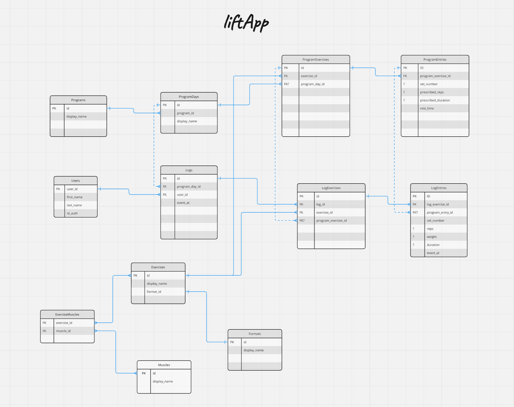

# GO REST API
A Restful API for logging workouts with GO using **gin** web framework and **gorm** (an ORM for Go). This project leverages boilerplate code from https://github.com/pilinux/gorest

## Installation & Run
```bash
# Download this project
go get github.com/themarcusmin/liftapp-server
```

Configure JWT. For this project, we will be using RS256.
```bash
openssl genpkey -algorithm RSA -out private-key.pem -pkeyopt rsa_keygen_bits:2048
openssl rsa -in private-key.pem -pubout -out public-key.pem
```


```bash
# Build and Run
go build -o liftapp ./app
./liftapp

# API Endpoint : http://127.0.0.1:8999
```

## API

#### /logs
* `POST` : Create a log

Request Body
| Name        | Type   | Required | Description                                      |
|-------------|--------|----------|--------------------------------------------------|
| `eventAt`        | string | Required | Date and time when a workout log is done |
| `logExercises`   | logExercises | Required | A list of exercise log |

```json
// example
{
    "eventAt": "2024-09-10T18:00:57Z",
    "logExercises": [
        {
            "exerciseID": 1,
            "logEntries": [
                {
                    "setNumber": 1,
                    "reps": 10,
                    "weight": 60,
                    "eventAt": "2024-09-10T17:00:57Z"
                },
                {
                    "setNumber": 2,
                    "reps": 12,
                    "weight": 60,
                    "eventAt": "2024-09-10T17:03:57Z"
                },
                {
                    "setNumber": 3,
                    "reps": 9,
                    "weight": 60,
                    "eventAt": "2024-09-10T17:03:57Z"
                }
            ]
        }
    ]
}
```

* `GET` : Retrieve all logs between startTime and endTime

Query Parameters
| Name        | Type   | Required | Description                                      |
|-------------|--------|----------|--------------------------------------------------|
| `startTime` | string | Required | Date and time in ISO 8601 Format |
| `endTime`   | string | Required | Date and time in ISO 8601 Format |

---

#### /exercises/recent1rm/:exercise_id
* `GET` : Get a 1RM from the past 5 logs

## ER Diagram


## TODO

```
- [] Integrate OpenAI plugin to generate fitness program
- [] API endpoint for generating program
```